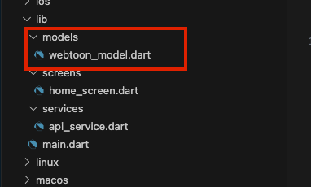

http.get 으로부터 받은 Json 형식의 데이터를 dart에서 이용하는 방법을 살펴보자.  

## models 폴더  

lib 하위에 models 라는 폴더를 만들어준다. 여기에는 flutter에서 이용할 여러 클래스들을 정의해준다.  

  

```dart
class WebtoonModel {
  final String title, thumb, id;

  WebtoonModel({
    required this.title,
    required this.thumb,
    required this.id,
  });
}
```

## jsonDecode  

http.get 을 통해 받은 응답은 String 형태이다. 하지만 기본적으로 http 응답의 body는 json 형태이다.  

받은 String 형태의 응답을 Json 으로 변경하기 위해서는 jsonDecode() 메서드를 이용하면 된다.  

```dart
final response = await http.get(url);
jsonDecode(response.body)
```

그리고 jsonDecode 의 설명을 보면 반환 데이터타입은 dynamic 임을 볼 수 있다.  

```dart
dynamic jsonDecode(String source, {Object? Function(Object?, Object?)? reviver})
Type: dynamic Function(String, {Object? Function(Object?, Object?)? reviver})

dart:convert

Parses the string and returns the resulting Json object.

...
```

이 말은 즉 jsonDecode 메서드의 반환값으로 다양한 데이터타입이 올 수 있고, 우리는 이 자료를 의미있고 효율적으로 받기 위해 자료형을 정의해줘야 한다.  

우선 응답의 형태를 다시 살펴보자.  

```json
// 응답
[
    {"id":"758150","title":"입학용병","thumb":"https://image-comic.pstatic.net/webtoon/758150/thumbnail/thumbnail_IMAG21_4135492154714961716.jpg"},
    {"id":"809706","title":"사랑받는 시집살이","thumb":"https://image-comic.pstatic.net/webtoon/809706/thumbnail/thumbnail_IMAG21_de9581cd-9dfc-4500-9c5c-62c4299a5c30.jpg"},
    {"id":"818806","title":"이웃집 연하","thumb":"https://image-comic.pstatic.net/webtoon/818806/thumbnail/thumbnail_IMAG21_e1b66355-0263-4fae-938f-ba9f8ff1ec9f.jpg"},
    {"id":"819910","title":"홍끼의 메소포타미아 신화","thumb":"https://image-comic.pstatic.net/webtoon/819910/thumbnail/thumbnail_IMAG21_3e1f29a1-2233-4e85-bb2f-3232a1b8ab81.jpg"},
    {"id":"818368","title":"피폐물 남주의 엄마가 되었다","thumb":"https://image-comic.pstatic.net/webtoon/818368/thumbnail/thumbnail_IMAG21_dbbb63bc-66fe-4934-a4fa-1a704b0a7ee6.jpg"},
    ...
]
```

가장 바깥에는 List 형태로 되어있고 그 안에는 Map 형태의 자료가 있다. Map 은 각각 id, title, thumb 라는 key로 key와 value 모두에 String 형태의 데이터를 담고 있다.  

말하자면 아래와 같은 것이다.  

```dart
[
    {"id" : "Some String",
    "title" : "Some Title String",
    "thumb" : "Some Uri String"}
]
```

jsonDecode 를 통해 자료가 어떻게 바뀌는지 알아보기 위해 아래와 같이 api_service 를 작성하고 실행해보도록 하자.  

```dart
final String baseUrl = "https://webtoon-crawler.nomadcoders.workers.dev";
final String today = "today";

final url = Uri.parse(baseUrl + "/" + today);
final response = await http.get(url); // 요청에 대한 응답을 받아옴
if (response.statusCode == 200) {
    // 요청 처리가 정상(200) 일 경우
    final List<dynamic> webtoons = jsonDecode(response.body);
    for (var webtoon in webtoons) {
    print(webtoon);
    }
    return;
}
throw Error(); // 요청 처리가 정상이 아닐 경우 Error를 발생시킨다.
```

출력은 아래와 같다.  

```bash
flutter: {id: 758150, title: 입학용병, thumb: https://image-comic.pstatic.net/webtoon/758150/thumbnail/thumbnail_IMAG21_4135492154714961716.jpg}
flutter: {id: 809706, title: 사랑받는 시집살이, thumb: https://image-comic.pstatic.net/webtoon/809706/thumbnail/thumbnail_IMAG21_de9581cd-9dfc-4500-9c5c-62c4299a5c30.jpg}
flutter: {id: 818806, title: 이웃집 연하, thumb: https://image-comic.pstatic.net/webtoon/818806/thumbnail/thumbnail_IMAG21_e1b66355-0263-4fae-938f-ba9f8ff1ec9f.jpg}
...
```

## json 형식 데이터를 class로 받기  

그렇다면 이렇게 받아온 json 형식의 데이터를 class 화 해보도록 하자.  

우선 이전에 만든 webtoonModel 클래스를 수정해보도록 한다.  
여기에서는 Named Constructor 를 사용해본다.  

```dart
// models/webtoon_models.dart

class WebtoonModel {
  final String title, thumb, id;

  WebtoonModel.fromJson(Map<String, dynamic> json)
      : id = json['id'],
        title = json['title'],
        thumb = json['thumb'];
}
```

여기서 쓰이는 NamedConstructor에 "fromJson" 이라는 명칭을 사용하는 것은 매우 보편화되어있다. flutter 프로젝트를 하다 보면 대부분 이러한 Json 형태의 응답을 받는 역할을 하는 class의 NamedConstructor에 대해 "fromJson"이라는 이름을 붙일 것이다. 참고.  

그리고 api_service에서 이 클래스를 이용해 json 데이터를 받아주도록 한다.  

```dart
// services/api_service.dart

final String baseUrl = "https://webtoon-crawler.nomadcoders.workers.dev";
final String today = "today";

void getTodaysToons() async {
final url = Uri.parse(baseUrl + "/" + today);
final response = await http.get(url); // 요청에 대한 응답을 받아옴
if (response.statusCode == 200) {
    // 요청 처리가 정상(200) 일 경우
    final List<dynamic> webtoons = jsonDecode(response.body);
    for (var webtoon in webtoons) {
    final toon = WebtoonModel.fromJson(webtoon); // WetoonModel 클래스로 정보를 받아옴
    }
    return;
}
throw Error(); // 요청 처리가 정상이 아닐 경우 Error를 발생시킨다.
}
```

이렇게 되면 response.body의 리스트 원소 원소에 담긴 title, id, thumb 정보를 토대로 초기화 된 새로운 클래스가 만들어진다. 

이렇게 클래스로 만들면 이제 해당 클래스의 property, method 에 쉽게 접근이 가능하다.  

```dart
...
final toon = WebtoonModel.fromJson(webtoon); // WetoonModel 클래스로 정보를 받아옴

toon.id      // 자료에서 받아온 id 값
toon.title   // title 값
toon.thumb   // thumb 값
```

## api 응답 받아오기 마무리  

아래와 같이 api 응답을 받아오는 기능을 마무리한다.  

```dart
import 'dart:convert';

import 'package:http/http.dart' as http;
import 'package:wetoon_app/models/webtoon_model.dart';

class ApiService {
  final String baseUrl = "https://webtoon-crawler.nomadcoders.workers.dev";
  final String today = "today";

  Future<List<WebtoonModel>> getTodaysToons() async {  // async(비동기) 이기 때문에 반환값을 Future로 감싸줘야 함
    List<WebtoonModel> webtoonsInstances = [];
    final url = Uri.parse(baseUrl + "/" + today);
    final response = await http.get(url); // 요청에 대한 응답을 받아옴
    if (response.statusCode == 200) {
      // 요청 처리가 정상(200) 일 경우
      final List<dynamic> webtoons = jsonDecode(response.body);
      for (var webtoon in webtoons) {
        webtoonsInstances.add(WebtoonModel.fromJson(webtoon)); // WetoonModel 클래스로 정보를 받아 리스트에 넣어줌
      }
      return webtoonsInstances;
    }
    throw Error(); // 요청 처리가 정상이 아닐 경우 Error를 발생시킨다.
  }
}
```

눈여겨볼 점  

-- api 응답을 받아와 리스트 형태로 return 하는 함수를 만들었다.  
-- async(비동기) 이기 때문에 함수의 반환값 형태를 Future<>로 감싸줘야 한다.  
-- 받아오는 정보를 기다려야 할 때에는 await 키워드를 작성해준다.  
-- 받아오는 정보를 WebtoonModel 이라는 클래스의 인스턴스로 받아온다.  
-- 그리고 이 WebtoonModel 인스턴스를 리스트에 넣어준 뒤 이 함수의 반환값으로 넣어줬다.  

