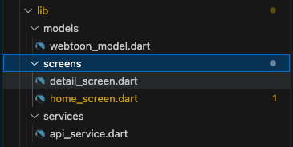

## 이동할 스크린(페이지) 만들기  

페이지는 보통 screens 폴더 아래에 만든다.  



DetailScreen이라는 파일로 만들어준다.  
우선은 App Bar만 만들어줌.  

```dart
import 'package:flutter/material.dart';

class DetailScreen extends StatelessWidget {
  final String id, title, thumb;

  const DetailScreen({
    super.key,
    required this.id,
    required this.title,
    required this.thumb,
  });

  @override
  Widget build(BuildContext context) {
    return Scaffold(
      backgroundColor: Colors.white,
      appBar: AppBar(
        elevation: 1,
        title: Text(
          title, // AppBar 제목을 title로 보여줌
          style: TextStyle(
            fontSize: 26,
            fontWeight: FontWeight.w600,
          ),
        ),
        backgroundColor: Colors.white,
        foregroundColor: Colors.green,
      ),
    );
  }
}
```

## 스크린(페이지) 전환  

스크린(페이지)를 전환할 때에는 Navigator 라는 위젯과 MaterialPageRoute 를 사용한다.  


```dart
GestureDetector(
    onTap: () {
    Navigator.push(  // StatelessWidget을 애니매이션을 이용해 스크린처럼 보이게 함
        context,
        MaterialPageRoute(
        builder: (context) => DetailScreen(
            id: id,
            title: title,
            thumb: thumb,
        ),
        ),
    );
    },
    child: //차일드
)
```

이렇게 작성시 위에서 만들어둔 DetaiScreen 위젯으로 전환되는 효과를 보여주는데, 아래와 같다.  


이 Navigator는 뒤로가기 버튼도 기본적으로 제공한다.  

그리고 이어서 다른 효과도 살펴보겠다.  

```dart
GestureDetector(
    onTap: () {
    Navigator.push(
        context,
        MaterialPageRoute(
        builder: (context) => DetailScreen(
            id: id,
            title: title,
            thumb: thumb,
        ),
        fullscreenDialog: true, // fullscreenDialog
        ),
    );
    },
    child: //차일드
)
```

fullscreenDialog는 바닥에서부터 새로운 페이지가 등장하게 한다.  


이 경우엔 뒤로가기가 아닌 닫기 버튼이 된다.  

## Navigator Widget  

네비게이터 위젯 설명을 읽어보면 알 수 있듯, 이는 stateful Widget 이다.  

이 네비게이터 위젯은 다른 페이지로 이동하는 기능을 제공한다. 그리고 stateful 이므로 상태를 관리할 수 있는 위젯이다.  

## MaterialPageRoute  

메테리얼 페이지 라우트는 페이지 전환의 애니메이션을 담당하는 위젯이다.

